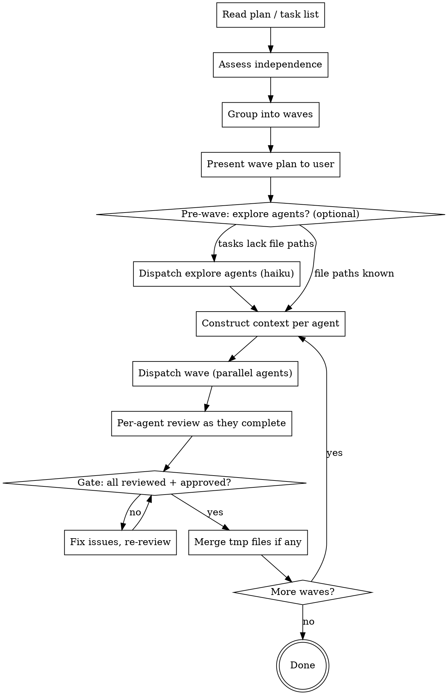

# Parallel Agents Dispatch

Execute multi-task workflows by grouping independent tasks into waves, dispatching parallel agents with controller-constructed context, and gating between waves. A wave of 1 task is sequential execution — no special case needed.

**You are the controller.** You (the orchestrating Claude session) construct every agent's context, select its model, and manage wave gates. Agents never inherit your session context — you build exactly what they need.

**Announce at start:** "I'm using parallel-agents-dispatch to execute these tasks."

## Progress Tracking

At the start, create a task list so the user can track progress:

```
TaskCreate: "Assess task independence and build wave plan"
TaskCreate: "Wave 1: [list task names] (parallel)"
TaskCreate: "Wave 1 gate: reviews + merge"
TaskCreate: "Wave 2: [list task names] (parallel)"
TaskCreate: "Wave 2 gate: reviews + merge"
... (one pair per wave)
```

Mark each task `in_progress` when starting, `completed` when done. The user sees a persistent task list at the bottom of their session.

When dispatching agents, always set `model:` explicitly so the user sees which model is being used (e.g., `Agent (...) haiku`).

## Why This Exists

Without this skill, you default to sequential execution with your session model for every agent. Agents explore the codebase freely, duplicating discovery work and bloating context. This skill fixes three problems:

1. **Token waste** — agents explore instead of receiving pre-constructed context
2. **No model optimization** — haiku-appropriate tasks run on opus
3. **No parallelism** — independent tasks execute sequentially

## When to Use

- You have a plan, task list, or set of tasks to execute
- Any workflow: spec-driven development, bugfix, ASIC pipeline, doc generation
- You don't decide upfront whether tasks are parallel — this skill assesses that

**When NOT to use — redirect instead:**
- **No existing plan or task list** (user wants to create one) → redirect to `build-plan` or `writing-plans`
- **Ad-hoc debugging** (user wants to investigate failures in parallel, no structured plan) → redirect to `dispatching-parallel-agents`
- **Single exploration question** (no multi-task workflow) → handle directly, no dispatch needed

**Relationship to existing skills:**
- `dispatching-parallel-agents` — ad-hoc debugging parallelism (different scope)
- `subagent-driven-development` — sequential execution in published plugin chain; this skill is the preferred execution path when you want smarter orchestration
- `build-plan` — produces plans whose phases map directly to waves

## The Process



---

## Step 1: Assessment Protocol

Before dispatching anything, assess task independence.

### Extract tasks and dependencies

For each task, identify:
- **Inputs:** files it reads, data it needs
- **Outputs:** files it writes/modifies
- **Dependencies:** data it needs from other tasks

### Independence rules

Tasks are **independent** if they don't write to the same file, neither reads the other's output, and they don't share mutable state.

Tasks are **dependent** if Task B reads Task A's output, both write to the same file, or Task B's spec references Task A's output.

**Circular dependencies** (A depends on B, B depends on A) cannot be resolved. Surface to human — the plan needs restructuring.

### Group into waves

```
Wave 1: all tasks with zero dependencies
Wave 2: tasks depending only on Wave 1 outputs
Wave 3: tasks depending only on Wave 1 + Wave 2 outputs
```

**When the plan already defines phases** (e.g., build-plan Phase A/B/C/D), adopt those directly — they already encode the dependency graph.

### Present the wave plan

Before dispatching, show the user:

```markdown
Wave plan:
  Wave 1 (3 tasks, parallel): Task A, Task B, Task C
  Wave 2 (2 tasks, parallel): Task D, Task E
  Wave 3 (1 task):            Task F

Dependencies:
  Task D depends on Task A output
  Task E depends on Task B output
  Task F depends on Task D + Task E output
```

---

## Step 2: Context Construction

This is the core of token efficiency. You pre-read everything and construct each agent's prompt — applying the controller principle above.

> **Read [`templates/agent-prompt.md`](templates/agent-prompt.md)** for the full prompt template.

### Construction rules

1. **Inline content, never reference.** Paste file contents into the prompt. The agent should never need Read/Glob/Grep.

2. **One task's context only.** Each agent sees only its own task text. Never paste the full plan.

3. **Shared writes go to tmp files.** If multiple agents would write to the same document:
   ```
   Agent A → .parallel-dispatch-tmp/wave1-taskA-output.md
   Agent B → .parallel-dispatch-tmp/wave1-taskB-output.md
   ```
   Tmp directory is `.parallel-dispatch-tmp/` at repo root. Merge at the gate, then delete.

4. **Include prior wave outputs if needed.** Inline Wave 1's outputs into Wave 2 prompts.

5. **State exclusions explicitly.** Tell the agent what it must NOT access. Omitting context is not enough — agents will "helpfully" read related files unless told not to.

6. **Context size check.** If the prompt exceeds ~30k tokens (~1500 lines of code + task description), the task scope is too broad. Split into subtasks. Exception: a task that legitimately needs a large input file — inline only the relevant sections, not the whole file.

### Example: constructing a context-isolated prompt

**Bad — agent explores on its own (token-expensive, no isolation):**
```
Agent(model: sonnet, prompt: "Implement the auth middleware. Read src/auth/ for context and tests/auth/ for tests.")
```
The agent runs 10+ Read/Glob calls, reads unrelated files, bloats its context.

**Good — controller inlines exactly what's needed:**
```
Agent(model: sonnet, prompt: """
You are implementing the auth middleware.

## Your Task
Add JWT validation to the request pipeline. Reject expired tokens with 401.

## Your Inputs
### contracts/auth_types.py
```python
class AuthConfig(TypedDict):
    secret_key: str
    expiry_seconds: int
    issuer: str
```

## Constraints
- You may only modify: src/auth/middleware.py
- Do NOT read: src/billing/, src/users/, tests/

## Expected Outcome
- Tests pass: pytest tests/auth/test_middleware.py -v
""")
```
The agent starts working immediately with zero discovery overhead.

### Pre-wave context gathering (optional)

If tasks don't specify exact file paths, dispatch Explore agents (model: haiku) to identify relevant files before constructing execution prompts. This is context gathering, not execution.

---

## Step 3: Wave Execution & Gate

### Dispatch

Dispatch all agents in a wave simultaneously via the Agent tool in a single message. Each agent gets its model set explicitly per the model selection table.

**Concurrency limit:** Maximum 8 agents per wave. If a wave has more than 8 tasks, sub-batch into groups of 8 — parallel within each sub-batch, sub-batches dispatched sequentially.

### Per-agent review

Reviews run as agents complete — don't wait for the whole wave. This overlaps review time with execution time.

```
Agent A returns DONE → dispatch spec reviewer immediately
Agent B still running...
Spec reviewer A approves ✅ → dispatch code quality reviewer for A
Agent B returns DONE → dispatch spec reviewer for B
...
```

> **Read [`templates/reviewer-prompt.md`](templates/reviewer-prompt.md)** for the spec compliance reviewer template.

**Review stages:**
1. **Spec compliance** — did the agent build what was asked? Nothing more, nothing less. (model: opus)
2. **Code quality** — is it well-built? Only after spec passes. (model: opus)
3. Issues found → re-dispatch implementer to fix → re-review

### Agent status handling

| Status | Action |
|---|---|
| `DONE` | Dispatch spec reviewer |
| `DONE_WITH_CONCERNS` | Read concerns first, address if needed, then spec review |
| `NEEDS_CONTEXT` | Provide missing context, re-dispatch (same model). Max 3 cycles, then escalate to human |
| `BLOCKED` | Context problem → provide more, re-dispatch. Too hard → re-dispatch one model tier up. Too large → split into subtasks for the NEXT wave. Current wave finishes first |

### Gate

All agents in a wave must be reviewed and approved before the next wave starts.

```markdown
Wave 1 gate:
- [ ] Task A: spec ✅ quality ✅
- [ ] Task B: spec ✅ quality ✅
- [ ] Task C: spec ✅ quality ✅

All checked → merge tmp files → Wave 2
```

### Tmp file merge

At the gate, if agents wrote to tmp files:
1. Read all tmp files from `.parallel-dispatch-tmp/`
2. Assemble into target document in task order
3. Delete tmp files
4. Merged output becomes available for next wave's agent prompts

### Gate failure

3 review iterations without passing → surface to human.

**Partial wave failure:** If some agents pass but others are surfaced to human:
1. Successful agents' work is committed and preserved
2. Failed agents' changes are stashed or reverted
3. Present the human with: what succeeded, what failed, and why
4. Human decides: fix failed tasks, restructure, or abort

---

## Step 4: Model Selection

Set the `model:` parameter explicitly on every Agent dispatch. Never rely on the session default.

| Task type | Signals | Model |
|---|---|---|
| Mechanical implementation | 1-2 files, clear spec, no design decisions | haiku |
| Doc generation | Single module docs, formatting, summarization | haiku |
| Context gathering | Explore agent, file discovery | haiku |
| Integration implementation | Multi-file, needs interface understanding | sonnet |
| Test writing | Derive tests from spec, judgment on edge cases | sonnet |
| Cross-module synthesis | Assembling multiple agent outputs | sonnet |
| Spec compliance review | Judge implementation against requirements | opus |
| Code quality review | Architectural judgment, design issues | opus |
| Debugging / escalation | Agent failed, needs deeper reasoning | opus |

### Decision shortcut

```
1-2 files, complete spec, no ambiguity?           → haiku
Multi-file, interfaces, edge case judgment?        → sonnet
Evaluating someone's work, architectural decisions? → opus
```

### Escalation

BLOCKED agent → re-dispatch one tier up (haiku → sonnet → opus). Opus blocked → surface to human.

---

## Red Flags

**Never:**
- Proceed past a gate with unapproved agents
- Dispatch code quality review before spec compliance passes
- Add BLOCKED subtasks to the current wave — they go in the next wave
- Ignore agent concerns (`DONE_WITH_CONCERNS`) — read them first

**If an agent asks questions:** Answer clearly, provide context, re-dispatch. Don't rush.

**If a reviewer finds issues:** Implementer fixes, reviewer re-reviews. Don't skip re-review.
