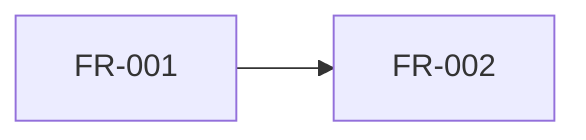

# Docs Index Builder

Mechanical generator that produces `INDEX.md` for an epic — the canonical FR-by-FR view. The `docs-engineering-ticket-shape` protocol forbids the engineering guide from naming FR ids in primary content; INDEX.md is where that view lives. Runs as a deterministic script — no LLM, no judgment.

## When to use

- After `/docs-write-story` ships a phase — regenerate INDEX.md so the new FRs appear in the roster view.
- In CI on every merge to a docs branch — keep the index fresh without manual edits.
- Standalone — point at any epic directory to regenerate INDEX.md from the current on-disk state.

## Input

```bash
docs-index-builder.sh <epic-dir> [--write | --check]
```

| Arg | Required | Description |
|-----|----------|-------------|
| `<epic-dir>` | yes | Path to an epic directory (e.g., `docs/<initiative>/epics/<epic>/`) |
| `--write` | no | Overwrite `<epic-dir>/INDEX.md` with the regenerated content (default) |
| `--check` | no | Diff regenerated content against current INDEX.md; exit 1 if drift detected |

## Output

- Exit code: `0` on success (or no drift in `--check` mode), `1` on drift in `--check` mode, `2` on tool error.
- `--write` mode: rewrites `<epic-dir>/INDEX.md` in place.
- `--check` mode: prints unified diff to stdout if drift exists.

## Regenerated INDEX.md shape

```markdown
---
name: <epic-name>-index
type: index
description: FR-by-FR view of <epic-name>
regenerated_at: <git-commit-hash>
version: 1
---

# <Epic Name> — Index

Generated by `docs-index-builder`. DO NOT edit by hand — re-run the tool instead.

## Phases

### Phase 1

| FR | Title | Status | Depends On | Conflicts With | Touches |
|----|-------|--------|------------|----------------|---------|
| [FR-001](phases/phase-1/stories/FR-001/story.md) | <title> | shipped | — | — | mod-a, mod-b |
| [FR-002](phases/phase-1/stories/FR-002/story.md) | <title> | drafting | FR-001 | — | mod-c |

### Phase 2

| FR | Title | Status | Depends On | Conflicts With | Touches |
| ... |

## Dependency Graph

(within each phase — cross-phase edges are forbidden by the protocol)



## Status Roll-Up

| Status | Count |
|--------|-------|
| skeleton | N |
| drafting | N |
| shipped | N |
| tested | N |

## Provenance

- Regenerated from on-disk story.md frontmatter at commit `<hash>`.
- Last regeneration touched FR ids: FR-NNN, FR-NNN, ...
```

## How it works

1. Walk `<epic-dir>/phases/phase-*/stories/FR-*/story.md`.
2. Parse each story.md frontmatter (id, title, phase, status, depends_on, conflicts_with, touches).
3. Group by phase; sort by FR id within each phase.
4. Render the roster table.
5. Build the dependency graph from `depends_on` edges (within-phase only — protocol guarantees this).
6. Compute the status roll-up.
7. Set `regenerated_at:` to current commit hash via `git rev-parse HEAD`.
8. In `--write` mode, write the file. In `--check` mode, diff against existing INDEX.md and exit 1 on drift.

## Implementation

`docs-index-builder.sh` — bash + yq for frontmatter parsing + simple template rendering. Designed to run in <1s on a typical epic directory.

## Out of scope

- Validation of frontmatter conformance — that's `docs-ticket-validator`'s job. This tool assumes inputs are valid; if a story.md is malformed, the regeneration may produce a degraded row but the tool itself does not error.
- Engineering-guide regeneration — that's `docs-eng-guide-writer`'s job. This tool produces only INDEX.md.
- Cross-epic indexes — initiative-level index (a roll-up across child epics) is a separate concern; this tool builds one INDEX.md per epic.
- FR content rewriting — this tool reads, never edits, story.md files.

## Failure handling

If the tool itself errors (unreadable directory, git unavailable, malformed frontmatter on a story.md), it exits with code `2` and prints a `TOOL FAILURE:` line naming the file and the parse failure. The tool does NOT silently skip malformed inputs — surfacing the error is preferable to producing a partial INDEX.md that hides the problem.

## Drift policy

The protocol forbids INDEX.md drift — if the on-disk story.md set changes, INDEX.md MUST be regenerated. Use `--check` mode in CI to gate merges on freshness. Manual edits to INDEX.md are forbidden; the file's frontmatter says so explicitly so reviewers know to re-run the tool rather than hand-patch.
